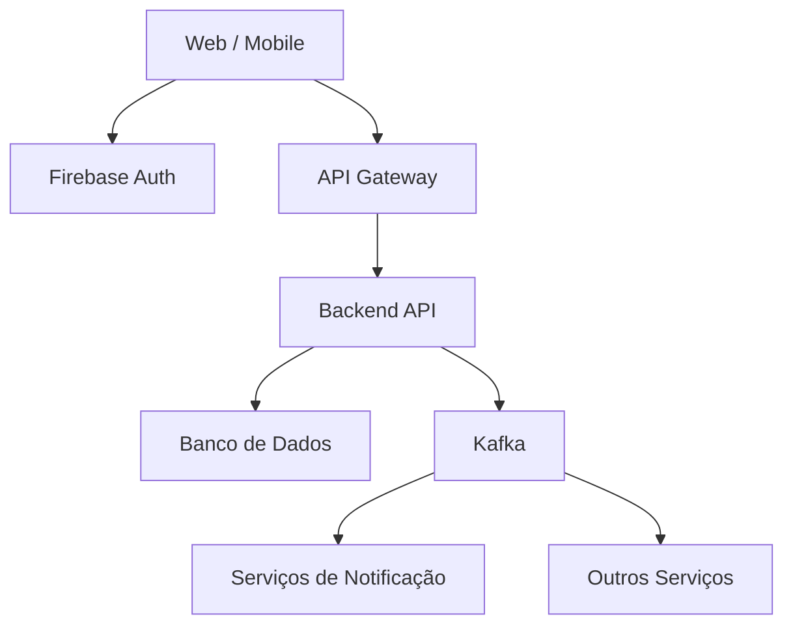

# Arquitetura da Solução

Definição de como o software é estruturado em termos dos componentes que fazem parte da solução e do ambiente de hospedagem da aplicação.



## Diagrama de Classes

O diagrama de classes ilustra graficamente como será a estrutura do software, e como cada uma das classes da sua estrutura estarão interligadas. Essas classes servem de modelo para materializar os objetos que executarão na memória.

As referências abaixo irão auxiliá-lo na geração do artefato “Diagrama de Classes”.

> - [Diagramas de Classes - Documentação da IBM](https://www.ibm.com/docs/pt-br/rational-soft-arch/9.6.1?topic=diagrams-class)
> - [O que é um diagrama de classe UML? | Lucidchart](https://www.lucidchart.com/pages/pt/o-que-e-diagrama-de-classe-uml)

## Documentação do Banco de Dados MongoDB

Este documento descreve a estrutura e o esquema do banco de dados não relacional utilizado por nosso projeto, baseado em MongoDB. O MongoDB é um banco de dados NoSQL que armazena dados em documentos JSON (ou BSON, internamente), permitindo uma estrutura flexível e escalável para armazenar e consultar dados.

## Esquema do Banco de Dados
### Coleção: users
Armazena as informações dos usuários do sistema.

Estrutura do Documento

```Json
{
    "_id": "ObjectId('5f7e1bbf9b2a4f1a9c38b9a1')",
    "name": " Maria Luíza",
    "email": "MariaLuiza.@example.com",
    "passwordHash": "hash_da_senha",
    "roles": ["admin", "victim", "volunteer", "support_units"],
    "skills":  [],
    "fcm_token": "ksknciwncie...",
    "createdAt": "2024-08-29T10:00:00Z",
    "updatedAt": "2024-08-29T12:00:00Z"
}
```

#### Descrição dos Campos
> - <strong>_id:</strong> Identificador único do usuário gerado automaticamente pelo MongoDB.
> - <strong>name:</strong> Nome completo do usuário.
> - <strong>email:</strong> Endereço de email do usuário.
> - <strong>passwordHash:</strong> Hash da senha do usuário.
> - <strong>roles:</strong> Lista de papéis atribuídos ao usuário (por exemplo, admin, user).
> - <strong>fcm_token:</strong> Token do dispositivo para envio de notificações push via Firebase. 
> - <strong>createdAt:</strong> Data e hora de criação do usuário.
> - <strong>updatedAt:</strong> Data e hora da última atualização dos dados do usuário.

### Coleção: support_units
Armazena as informações das unidades de apoio cadastradas na plataforma.

```Json
{
  "_id": "ObjectId('unt001')",
  "support_unit_user_id": "ObjectId('usr003')",
  "name": "Abrigo Centro",
  "CNPJ": "12.345.678/0001-99",
  "description": "Centro de apoio a vítimas de desastres naturais",
  "contact": {
    "email": "ong@email.com",
    "phone": "(85) 99999-0000"
  },
  "location": {
    "lat": -3.7172,
    "lng": -38.5433
  },
  "capacity": 150,
  "current_occupancy": 87,
  "services_available": ["água", "alimentação", "médico"],
  "status": "open",
  "validated": true,
  "createdAt": "2025-02-15T10:00:00Z",
  "updatedAt": "2025-03-05T10:00:00Z"
}
```

#### Descrição dos Campos
> - <strong>_id:</strong> Identificador único da unidade de apoio gerado automaticamente pelo MongoDB.
> - <strong>support_unit_user_id:</strong> Referência ao usuário com role support_unit responsável pela unidade.
> - <strong>name:</strong> Nome da unidade de apoio.
> - <strong>CNPJ:</strong> CNPJ da organização responsável pela unidade.
> - <strong>description:</strong> Descrição geral da unidade de apoio.
> - <strong>contact:</strong> Objeto com informações de contato da unidade.
> - <strong>contact.email:</strong> Email de contato da unidade.
> - <strong>contact.phone:</strong> Telefone de contato da unidade.
> - <strong>location:</strong> Objeto com as coordenadas geográficas da unidade (índice 2dsphere para busca por proximidade).
> - <strong>location.lat:</strong> Latitude da unidade.
> - <strong>location.lng:</strong> Longitude da unidade.
> - <strong>capacity:</strong> Capacidade máxima de pessoas que a unidade pode abrigar.
> - <strong>current_occupancy:</strong> Número atual de pessoas na unidade.
> - <strong>services_available:</strong> Lista de serviços oferecidos pela unidade (ex: "água", "alimentação", "médico").
> - <strong>status:</strong> Status atual da unidade. Valores possíveis: open, full, closed.
> - <strong>validated:</strong> Indica se a unidade foi validada pelo admin e está visível no mapa.
> - <strong>createdAt:</strong> Data e hora de criação da unidade.
> - <strong>updatedAt:</strong> Data e hora da última atualização dos dados da unidade.

### Coleção: support_unit_validations
Armazena o histórico de validações das unidades de apoio realizadas pelos administradores.

Estrutura do Documento

```Json
{
  "_id": "ObjectId('val001')",
  "support_unit_id": "ObjectId('unt001')",
  "reviewed_by": "ObjectId('usr004')",
  "status": "approved",
  "rejection_reason": null,
  "reviewed_at": "2025-02-17T10:00:00Z",
  "createdAt": "2025-02-15T10:00:00Z",
  "updatedAt": "2025-02-17T10:00:00Z"
}
```

#### Descrição dos Campos
> - <strong>_id:</strong> Identificador único da validação gerado automaticamente pelo MongoDB.
> - <strong>support_unit_id:</strong> Referência à unidade de apoio que está sendo validada.
> - <strong>reviewed_by:</strong> Referência ao usuário admin que realizou a análise. Nulo enquanto pendente.
> - <strong>status:</strong> Status da validação. Valores possíveis: pending, approved, rejected.
> - <strong>rejection_reason:</strong> Motivo da rejeição, preenchido apenas quando o status é rejected.
> - <strong>reviewed_at:</strong> Data e hora em que a análise foi realizada. Nulo enquanto pendente.
> - <strong>createdAt:</strong> Data e hora de criação do registro de validação.
> - <strong>updatedAt:</strong> Data e hora da última atualização do registro.

### Coleção: donation_needs
Armazena as necessidades de doação registradas pelas unidades de apoio.

Estrutura do Documento

```Json
{
  "_id": "ObjectId('don001')",
  "support_unit_id": "ObjectId('unt001')",
  "item_name": "Água mineral",
  "quantity_needed": 200,
  "quantity_received": 45,
  "priority": "critical",
  "status": "partially_fulfilled",
  "createdAt": "2025-03-05T10:00:00Z",
  "updatedAt": "2025-03-08T10:00:00Z"
}
```

#### Descrição dos Campos
> - <strong>_id:</strong> Identificador único da necessidade de doação gerado automaticamente pelo MongoDB.
> - <strong>support_unit_id:</strong> Referência à unidade de apoio que registrou a necessidade.
> - <strong>item_name:</strong> Nome do item necessário (ex: "Água mineral", "Cobertores", "Medicamentos").
> - <strong>quantity_needed:</strong> Quantidade total do item necessário.
> - <strong>quantity_received:</strong> Quantidade já recebida do item.
> - <strong>priority:</strong> Nível de prioridade da necessidade. Valores possíveis: low, medium, high, critical.
> - <strong>status:</strong> Status atual da necessidade. Valores possíveis: pending, partially_fulfilled, fulfilled, cancelled.
> - <strong>createdAt:</strong> Data e hora de criação da necessidade.
> - <strong>updatedAt:</strong> Data e hora da última atualização da necessidade.

### Coleção: missions
Armazena as missões de ajuda criadas pelas unidades de apoio.

Estrutura do Documento

```Json
{
  "_id": "ObjectId('mis001')",
  "support_unit_id": "ObjectId('unt001')",
  "title": "Voluntários eletricistas ",
  "description": "Precisamos de uma pessoas com conhecimentos em manuntenção eletrica. ",
  "status": "open",
  "required_skills": ["eletricistas", "manuntenção eletrica"],
  "createdAt": "2025-03-05T10:00:00Z",
  "updatedAt": "2025-03-05T10:00:00Z"
}
```

#### Descrição dos Campos
> - <strong>_id:</strong> Identificador único da missão gerado automaticamente pelo MongoDB.
> - <strong>support_unit_id:</strong> Referência à unidade de apoio que criou a missão.
> - <strong>title:</strong> Título da missão.
> - <strong>description:</strong> Descrição detalhada da missão.
> - <strong>status:</strong> Status atual da missão. Valores possíveis: open, in_progress, completed, cancelled.
> - <strong>required_skills:</strong> Lista de habilidades necessárias para realizar a missão (usada para filtrar voluntários compatíveis).
> - <strong>createdAt:</strong> Data e hora de criação da missão.
> - <strong>updatedAt:</strong> Data e hora da última atualização da missão.

### Coleção: mission_volunteers
Armazena as candidaturas de voluntários às missões de ajuda.

Estrutura do Documento

```Json
{
  "_id": "ObjectId('mv001')",
  "mission_id": "ObjectId('mis001')",
  "user_id": "ObjectId('usr002')",
  "status": "approved",
  "createdAt": "2025-03-06T10:00:00Z",
  "updatedAt": "2025-03-07T10:00:00Z"
}
```

#### Descrição dos Campos
> - <strong>_id:</strong> Identificador único da candidatura gerado automaticamente pelo MongoDB.
> - <strong>mission_id:</strong> Referência à missão para a qual o voluntário se candidatou.
> - <strong>user_id:</strong> Referência ao usuário voluntário que se candidatou.
> - <strong>status:</strong> Status da candidatura. Valores possíveis: pending, approved, rejected, completed, withdrawn.
> - <strong>createdAt:</strong> Data e hora de criação da candidatura.
> - <strong>updatedAt:</strong> Data e hora da última atualização da candidatura.


### Coleção: notifications
Armazena o histórico de notificações enviadas aos usuários da plataforma.

Estrutura do Documento

```Json
{
  "_id": "ObjectId('not001')",
  "user_id": "ObjectId('usr002')",
  "content": "Sua candidatura para 'Voluntário  eletricista' foi aprovada!",
  "type": "mission_approved",
  "read": false,
  "ref_id": "ObjectId('mv001')",
  "ref_type": "MissionVolunteer",
  "createdAt": "2025-03-07T10:00:00Z",
  "updatedAt": "2025-03-07T10:00:00Z"
}
```

#### Descrição dos Campos
> - <strong>_id:</strong> Identificador único da notificação gerado automaticamente pelo MongoDB.
> - <strong>user_id:</strong> Referência ao usuário que recebe a notificação.
> - <strong>content:</strong> Texto da notificação exibido ao usuário.
> - <strong>type:</strong> Tipo da notificação. Valores possíveis: urgent_donation, mission_approved, mission_rejected, new_mission, unit_validated, certificate_issued.
> - <strong>read:</strong> Indica se o usuário já leu a notificação.
> - <strong>ref_id:</strong> Referência polimórfica ao documento que originou a notificação (ex: mission_id, certificate_id).
> - <strong>ref_type:</strong> Tipo do documento referenciado (ex: Mission, MissionVolunteer, Certificate).
> - <strong>createdAt:</strong> Data e hora de criação da notificação.
> - <strong>updatedAt:</strong> Data e hora da última atualização da notificação.

### Coleção: certificates
Armazena os certificados de participação emitidos pela plataforma após confirmação da unidade de apoio.

Estrutura do Documento

```Json
{
  "_id": "ObjectId('cer001')",
  "user_id": "ObjectId('usr002')",
  "mission_id": "ObjectId('mis001')",
  "support_unit_id": "ObjectId('unt001')",
  "issued_by": "ObjectId('usr003')",
  "hours": 8,
  "certificate_code": "CERT-2025-A3KP9X",
  "issued_at": "2025-03-10T10:00:00Z",
  "createdAt": "2025-03-10T10:00:00Z",
  "updatedAt": "2025-03-10T10:00:00Z"
}
```

#### Descrição dos Campos
> - <strong>_id:</strong> Identificador único do certificado gerado automaticamente pelo MongoDB.
> - <strong>user_id:</strong> Referência ao voluntário que recebe o certificado.
> - <strong>mission_id:</strong> Referência à missão concluída pelo voluntário.
> - <strong>support_unit_id:</strong> Referência à unidade de apoio onde a missão foi realizada.
> - <strong>issued_by:</strong> Referência ao usuário com role support_unit que confirmou a participação do voluntário.
> - <strong>hours:</strong> Quantidade de horas trabalhadas confirmadas pela unidade de apoio.
> - <strong>certificate_code:</strong> Código único de verificação do certificado (ex: CERT-2025-A3KP9X). Gerado pela plataforma.
> - <strong>issued_at:</strong> Data e hora em que o certificado foi emitido pela plataforma.
> - <strong>createdAt:</strong> Data e hora de criação do registro.
> - <strong>updatedAt:</strong> Data e hora da última atualização do registro.


## Tecnologias Utilizadas

#### Aqui está a descrição das tecnologias e o diagrama de arquitetura do **SOS Connect**:

| Categoria              | Tecnologia                         | Descrição |
|----------------------|------------------------------------|----------|
| Linguagem            | TypeScript                         | Utilizada no backend e frontend, garantindo tipagem estática e menos erros em tempo de execução. |
| Backend              | NestJS + Node.js                   | Framework modular e escalável que segue princípios SOLID, com arquitetura baseada em módulos (users, auth, missions, etc). |
| Banco de Dados       | MongoDB Atlas                      | Banco NoSQL na nuvem com suporte a índices geoespaciais (2dsphere) para buscas por proximidade. |
| ODM                  | Mongoose                           | Mapeia documentos do MongoDB para classes TypeScript com validação de schema. |
| Autenticação         | JWT + Passport.js                  | Autenticação stateless com envio de token no header `Authorization: Bearer`. |
| Segurança de Senha   | bcrypt                             | Geração de hash seguro para senhas (sem armazenamento em texto puro). |
| Notificações         | Firebase Cloud Messaging (FCM)     | Serviço para envio de notificações push em dispositivos mobile e web. |
| Geração de PDFs      | PDFKit                             | Criação de certificados em PDF diretamente no backend. |
| Validação de Dados   | class-validator + class-transformer| Validação automática via decorators nos DTOs. |
| Testes               | Jest                               | Framework de testes unitários integrado ao NestJS. |
| IDE                  | VS Code                            | Ambiente de desenvolvimento com extensões para TypeScript e REST Client. |
| Versionamento        | Git + GitHub                       | Controle de versão com organização por branches de features. |
| Teste de API         | Insomnia                           | Ferramenta para testar endpoints da API. |

## Diagrama de Fluxo da Requisição


O diagrama representa o fluxo completo de uma requisição dentro do **SOS Connect**, desde a interação do usuário até a resposta final da API.

1. **Cliente (Web ou Mobile)**  
   O usuário inicia uma ação através da interface da aplicação.

2. **Entrada na API (NestJS)**  
   A requisição é recebida pelo backend estruturado com NestJS.

3. **Autenticação (Guards JWT)**  
   Antes de qualquer processamento, os *Guards* verificam a validade do token JWT enviado no header `Authorization`.  
   Apenas requisições autenticadas seguem adiante.

4. **Controller (Roteamento)**  
   O *Controller* identifica a rota correta e direciona a requisição para o método apropriado.

5. **Service (Regra de Negócio)**  
   O *Service* executa a lógica da aplicação, garantindo separação de responsabilidades e organização do código.

6. **Integrações Externas**
   Dependendo da operação, o sistema se comunica com:
   - **MongoDB Atlas** → Persistência e consulta de dados  
   - **Firebase Cloud Messaging (FCM)** → Envio de notificações push  
   - **PDFKit** → Geração de certificados em PDF  

7. **Resposta da API**  
   Após o processamento, a API retorna uma resposta em formato **JSON**, acompanhada do **código HTTP apropriado** (200, 201, 400, 401, etc).

Esse fluxo segue a arquitetura em camadas do NestJS, promovendo:
- Escalabilidade
- Manutenibilidade
- Separação clara de responsabilidades (SRP - SOLID)

---

## Hospedagem 

A API foi hospedada utilizando a plataforma Render, com integração direta ao GitHub para deploy automático (CI/CD).

### Etapas do Deploy

* Criação do arquivo `.env.example` com as variáveis de ambiente necessárias
* Conexão do repositório ao Render
* Configuração do serviço:

  * Runtime: Node.js
  * Diretório: `src/backend`
  * Build: `npm install && npm run build`
  * Start: `npm run start:prod`
* Definição das variáveis de ambiente na plataforma (`MONGODB_URI`, `JWT_SECRET`, etc.)

### Acesso

A aplicação está disponível em:

```
https://sos-connect-api.onrender.com
```

Exemplos de endpoints:

* `GET /api/users`
* `POST /api/auth/login`

### Deploy Contínuo

A cada `git push` na branch `main`, o Render realiza automaticamente um novo build e deploy da aplicação.

### Observação

O plano gratuito pode causar hibernação após períodos de inatividade, resultando em um tempo inicial de resposta mais lento.

## Qualidade de Software

Conceituar qualidade de fato é uma tarefa complexa, mas ela pode ser vista como um método gerencial que através de procedimentos disseminados por toda a organização, busca garantir um produto final que satisfaça às expectativas dos stakeholders.

No contexto de desenvolvimento de software, qualidade pode ser entendida como um conjunto de características a serem satisfeitas, de modo que o produto de software atenda às necessidades de seus usuários. Entretanto, tal nível de satisfação nem sempre é alcançado de forma espontânea, devendo ser continuamente construído. Assim, a qualidade do produto depende fortemente do seu respectivo processo de desenvolvimento.

A norma internacional ISO/IEC 25010, que é uma atualização da ISO/IEC 9126, define oito características e 30 subcaracterísticas de qualidade para produtos de software.
Com base nessas características e nas respectivas sub-características, identifique as sub-características que sua equipe utilizará como base para nortear o desenvolvimento do projeto de software considerando-se alguns aspectos simples de qualidade. Justifique as subcaracterísticas escolhidas pelo time e elenque as métricas que permitirão a equipe avaliar os objetos de interesse.

> **Links Úteis**:
>
> - [ISO/IEC 25010:2011 - Systems and software engineering — Systems and software Quality Requirements and Evaluation (SQuaRE) — System and software quality models](https://www.iso.org/standard/35733.html/)
> - [Análise sobre a ISO 9126 – NBR 13596](https://www.tiespecialistas.com.br/analise-sobre-iso-9126-nbr-13596/)
> - [Qualidade de Software - Engenharia de Software 29](https://www.devmedia.com.br/qualidade-de-software-engenharia-de-software-29/18209/)
